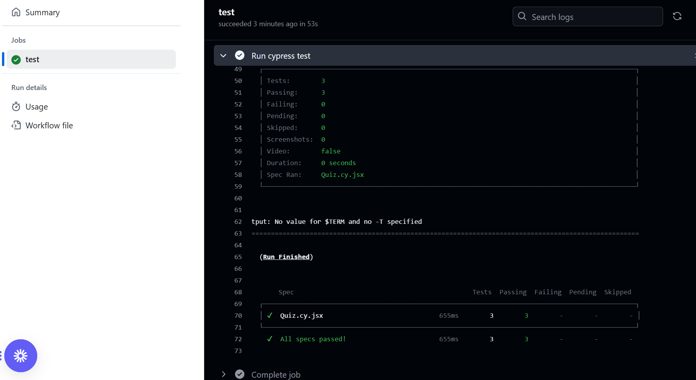
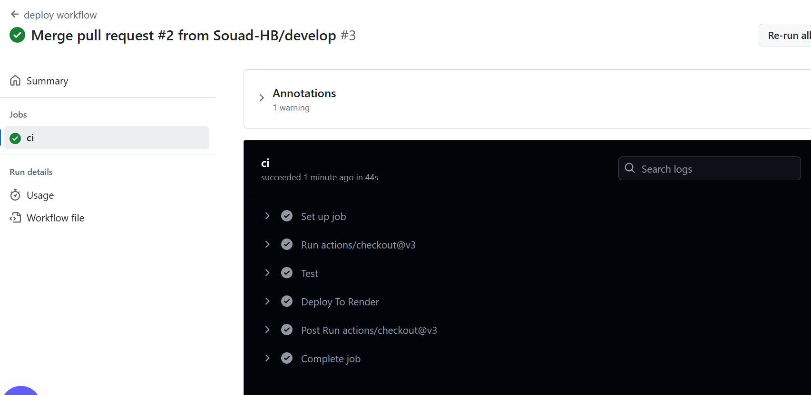

# **Coding Quiz**


---

# Table of Contents

- [Project Description](#project-description)
- [Screenshots](#screenshots)
- [Technologies Used](#technologies-used)
- [Setup and Installation](#setup-and-installation)
- [Demonstration](#demonstration)
- [Tests](#Tests)
- [Questions](#questions)
- [License](#license)

---

## Project Description

In today's dynamic development environment, testing is not just an afterthought but a critical part of the development process that ensures applications meet user demands and perform efficiently under various conditions. Coding Quiz is an a MERN stack allows users to take a quiz of ten random questions and view their final score. This has got tests implemented using Cypress.
This project has *Github Actions* implemented, where one yml file is dedicated for testing Cypress tests and the other for deployment on Render

---

## Screenshots

- Testing via Github Actions:
  

- Deployment via Github Actions:
  

---

## Technologies Used

- **FrontEnd**: React.js, Bootstrap
- **Backend**: Node.js, Express.js
- **Database**: MongoDB, Mongoose ORM
- **Tests**: Cypress, @testing-library/cypress
- **CI/CD**: Github Actions

---

## Setup and Installation

Follow these steps to get the application running on your local machine:

1. Clone the Repository

   ```bash
    git clone <repository-url>
    cd coding-quiz
   ```

2. Install Dependencies

   ```bash
   npm install
   ```

3. Access the App

   Setup the environment variables

   ```bash
    MONGO_URI=<your-mongodb-connection-string>
   ```

4. Run the application

   You need the app running and then open another terminal to run cypress and see the tests pass!

   ```bash
   npm run start:dev
   npm run cypress
   ```

---

## Demonstration

Click on this [Link](https://coding-quiz-lqel.onrender.com) to see the app live!!

## Tests

Component Test: Verifies the isolated behavior of React components using Cypress.

## Questions

For any questions please reach out by email, and feel free to check my github:

<table>
  <tr>
    <td align="center">
      <a href="https://github.com/souad-hb">
        
        <br />
        <sub><b>Souad</b></sub>
      </a>
      <br />
      <a href="mailto:souadsalahh@gmail.com">souadsalahh@gmail.com</a>
    </td>
  </tr>
</table>

---

## License

This project is licensed under the [MIT License](https://opensource.org/licenses/MIT).
